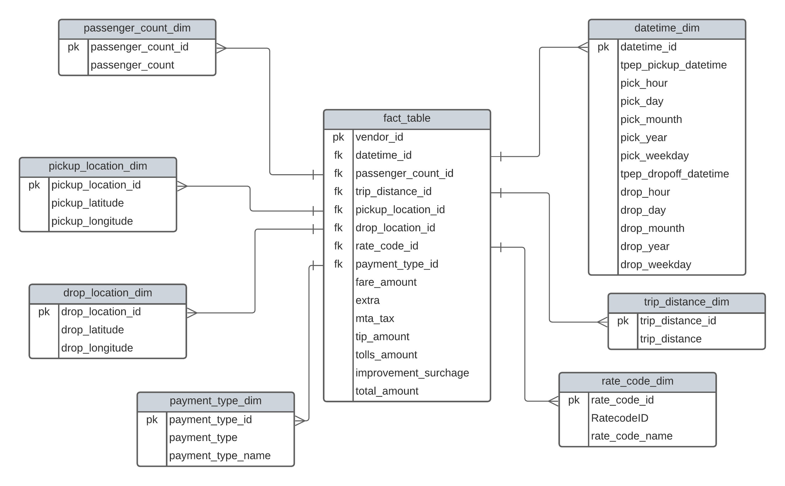
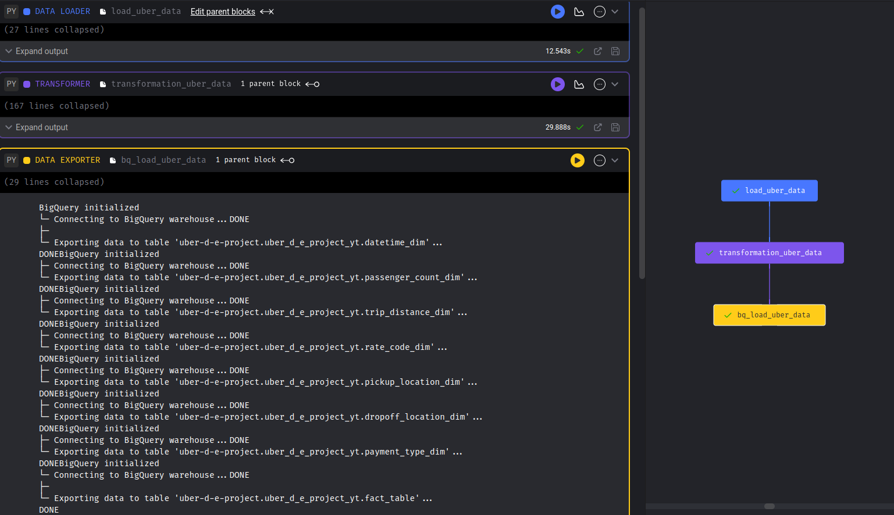
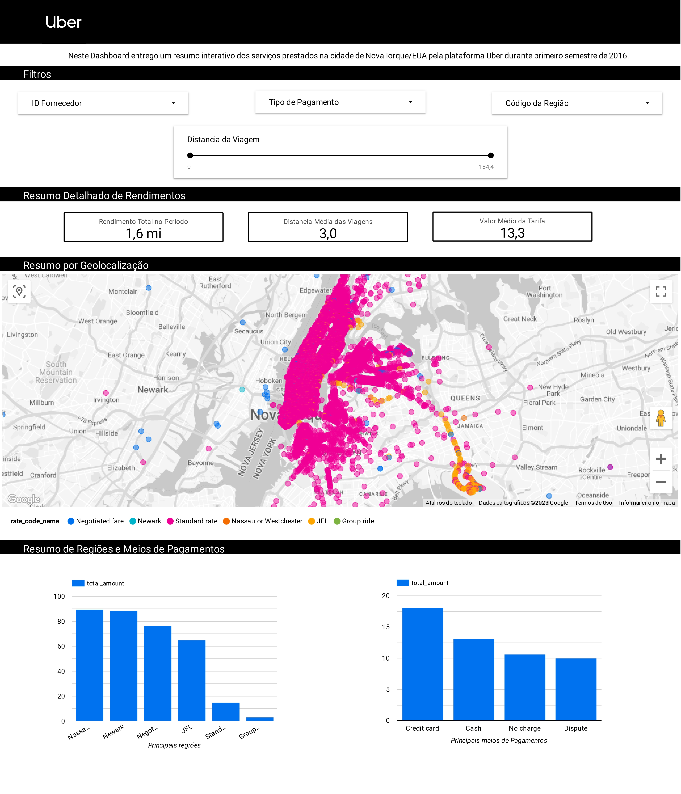

# Projeto Moderno de Engenharia de Dados GCP | Análise de Dados Uber

> ### Com o objetivo de obter as melhoras práticas do mercado, realizo uma análize de Dados da Uber usando diferentes ferramentas e tecnologias.

## Intrudução
Utilizando Dados de origem pública, disponibilizados pela cidade de Nova Iorque/EUA, inicio as atividades criando um 'schema' dos Dados via Lucid.app, no Jupyter Notebook, realizo uma pré-análise dos Dados afim de definir as melhores configurações, em seguida, crio um cenário via GCP Compute Engine e 'Carrego' os Dados de forma bruta no GCP Cloud Storage, via VM Debian SSH, inicio as operações de ETL utilizando o Mage, repaso a localização do GCP Cloud Storage para 'Extrair' os Dados, transfiro as configurações definidas no Jupiter Notebook para a etapa de 'Transformação' e 'Carrego' os Dados no Data Warehouse utilizando configurações via GCP BigQuery. 

Dentro da ferramenta GCP BigQuery, configuro uma nova 'Table' com SQL e integro ao Looker Studio para produzir um Dashboard interativo com Filtros, Resumo detalhado de Valores, Resumo por Geolocalização e Resumo gráficos em Barras.  

## Linguagem de programação 
> Python e
> SQL

## Computação em Nuvem 
> GCP (Cloud Storage, Compute Engine, Compute Instance, BigQuery)

## Ferramenta para ETL
> Mage Data Pipeline Tool

 ## Visualização
> Looker Studio 

## Arquitetura

## Conjunto de Dados Utilizado
Dados de registro de viagem do TLC

Mais informações sobre o conjunto de dados podem ser encontradas aqui:

Website - https://www.nyc.gov/site/tlc/about/tlc-trip-record-data.page

Dicionario dos Dados - https://www.nyc.gov/assets/tlc/downloads/pdf/data_dictionary_trip_records_yellow.pdf

## Modelagem de Dados

## ETL Mage + Compute Engine

## Dashboard Uber

Ferramenta moderna de pipeline de dados - https://www.mage.ai/

Contribua para este belo projeto de código aberto - https://github.com/mage-ai/mage-ai

Mais informações <a href="https://www.linkedin.com/in/mario-barcelos/">Mario Barcelos</a>

Agradecimentos Darshil Parmar
